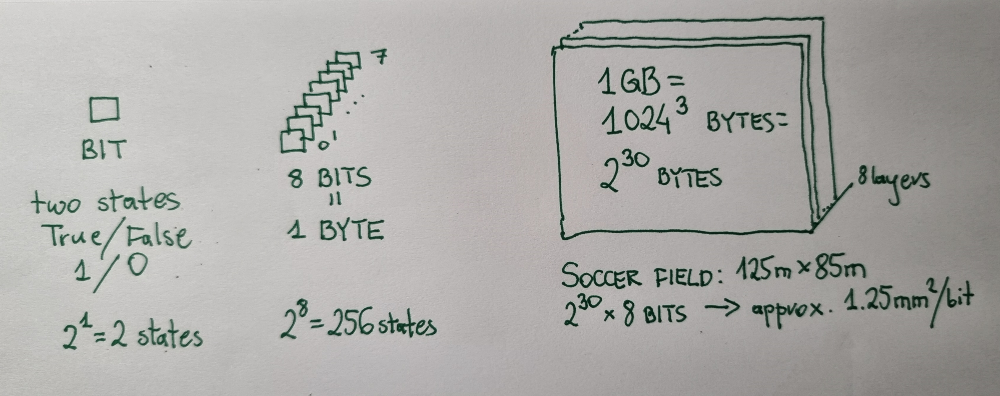
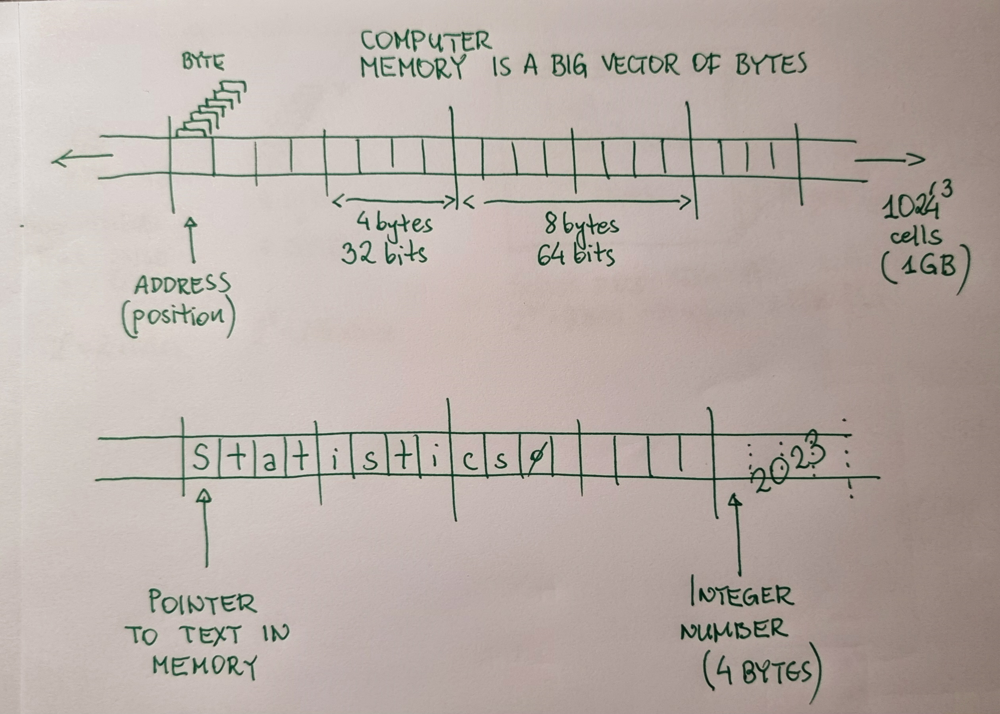

# Memory units and organization

- A [*bit*](https://en.wikipedia.org/wiki/Bit) is the most basic unit of information. A bit of memory can store one of two states, usually denoted: 0/1, no/yes, false/true.
- A [*byte*](https://en.wikipedia.org/wiki/Byte) is a commonly used unit of information equivalent to what can be stored in 8 bits, so one of 2\^8 = 256 states. A byte often represents:
    - An integer number in unsigned range 0..255 or signed range -128..127.
    - A character (letter, digit, etc) based on some convention (see [American Standard Code for Information Interchange](https://en.wikipedia.org/wiki/ASCII)).
    - Naturally, integer numbers from broader ranges or real numbers require more bytes. 4 or 8 bytes per a value are [standard choices](https://en.wikipedia.org/wiki/IEEE_754) for which computer processors are designed.
- A *byte* is often impractical. Other frequently used information amounts:
    - 1 KB (*kilobyte*) = 2\^10 bytes = 1_024 bytes  
    (a standard page of text is 3000 characters, so around 3KB)
    - 1 MB (megabyte) = 2\^20 bytes = 1_048_576 bytes  
    (a single frame of a not-too-high-quality image is roughly in 1MB range)
    - 1 GB (gigabyte) = 2\^30 bytes = 1_073_741_824 bytes  
    (4GB-32GB is currently a typical internal memory size in computers/mobile phones)
    - 1 TB (terabyte) = 2\^40 bytes = 1_099_511_627_776 bytes\
    (0.5TB-2TB is currently a typical external memory size in computers/mobile phones)

- Simplifying, the *operational memory* of a computer can be thought as a huge (e.g. 8GB), one-dimensional vector of memory cells (each of size of one byte).  
    The bytes are ordered -- each has its unique, sequential index -- called the *memory address*.
- When you *create* an object (for example a list) a memory manager *allocates* a region of memory for the object and then the object's data are created there.  
    The memory address of the region's start, which is an integer number, is called *a pointer to* the object (or *a reference to* the object).
-  Let's assume that a variable `var` contains a list and you execute `var2 = var`.\
    Note that there might be different behaviors here:
    - A *deep copy* (or *passing by value*) creates a completely separate copy of the list from `var` in a newly allocated piece of memory. This is a slow operation. After it changes of `var2` values will not affect values in `var`.
    - A *shallow copy* (or *passing by reference*) makes `var2` to point to the same list as in `var`. This is a fast operation. After it changes made in `var2` values would change the values accesible through `var`.
- *Immutability* (or *immutable* types) is a programming concept which allows to declare that an object will never change once it is created. Such objects can be safely copied fast by reference and remain always unchanged.

